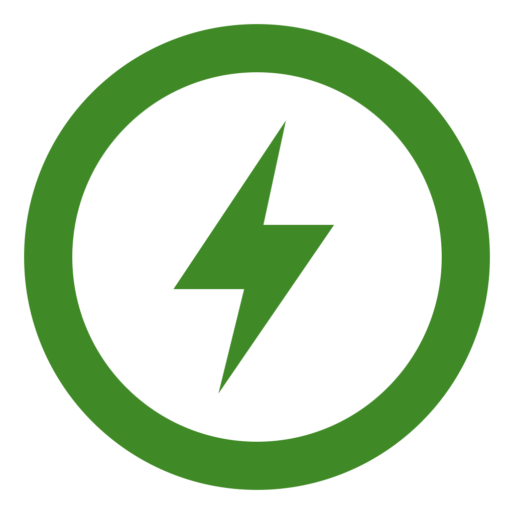

    
     
    <b>Stromkreis client for iOS</b>

## Introduction

This is the native iOS app for [Stromkreis](https://stromkreis.net) – the open platform by energy
communities for energy communities. It connects members of an Austrian energy community (EEG) to their Stromkreis
gateway through the Stromkreis Cloud (`https://hac.stromkreis.net`).

The Stromkreis gateway runs on [openHAB](https://www.openhab.org); this app is a fork of the
[openHAB iOS client](https://github.com/openhab/openhab-ios) (EPL-2.0), reduced to the one thing Stromkreis
members use: the openHAB **Main UI**.

## What the app does

* Shows the member's openHAB Main UI in a web view, with the Main UI navigation bar mirrored natively.
* Is set up once through a QR code or setup link from the Stromkreis platform
  (see [docs/stromkreis-onboarding.md](docs/stromkreis-onboarding.md)); there are no settings screens.
* Keeps the connection to the Stromkreis Cloud alive, retries with backoff, and asks the member to re-run the
  setup when the cloud rejects the stored credentials.

## What the app deliberately does not contain

Everything from the upstream openHAB client that is not needed for the Main UI was removed:

* no native sitemap renderer, tiles, HABPanel or multiple-home switching
* no Apple Watch app, widgets, complications, Siri shortcuts or CarPlay
* no push notifications (neither Firebase Cloud Messaging nor Apple Push Notification service) and no
  notification service extension
* no Firebase / Crashlytics or any other analytics or crash-reporting SDK
* no openHAB REST client: the only REST call left is a reachability probe of `/rest/`

The only third-party Swift packages are [SFSafeSymbols](https://github.com/SFSafeSymbols/SFSafeSymbols)
(type-safe SF Symbol names) and [swift-timeout](https://github.com/swhitty/swift-timeout) (connection
timeouts), plus SwiftFormat/SwiftLint as build tools.

## Setting up development environment

The app is developed using Xcode and the standard iOS SDK from Apple and targets iOS 18.

- Download and install [Xcode](https://developer.apple.com/xcode/downloads/)
- Check out the code from GitHub
- Open the project workspace `openHAB.xcworkspace`

Build: `xcodebuild -workspace openHAB.xcworkspace -scheme openHAB`; unit tests: `fastlane unittests`.
See [AGENTS.md](AGENTS.md) for the project layout and conventions and
[CONTRIBUTING.md](CONTRIBUTING.md) before producing any amount of code.

## Trademark Disclaimer

Product names, logos, brands and other trademarks referred to within the openHAB website are the
property of their respective trademark holders. These trademark holders are not affiliated with
openHAB or our website. They do not sponsor or endorse our materials.

Apple, the Apple logo, iPhone, and iPad are trademarks of Apple Inc., registered in the U.S. and other countries and regions. App Store is a service mark of Apple Inc.
